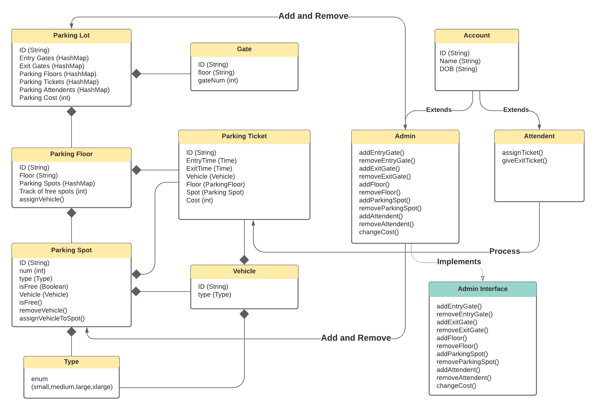

# Parking Lot System Design  

   <b>Class Diagram</b>  
  

 

## System Description
1. The parking lot will have multiple parking floors on which customers can park their vehicle.
2. Every parking floor will have several parking slots for different types of vehicles.
3. The parking lot will hae multiple entry and exit gates.
4. Customers can take the parking ticket on their way in and leave at the exit by paying parking amount.
5. The admin will take care of the structure of parking lot and there will be some parking attendents
who will take care of vehicles at entry and exit points and assign them tickets.
6. If the parking slots for a vehicle type is full the system wont allow that vehicle to come in.
7. There will be different type of slots for different vehicles on every floor that are Small,Medium,Large,Xlarge.
8. At exit the customer will be charged depending on the number of minutes he parked.
 

## Classes Description

### Parking Lot:
The main part of the system which has details of all the parking floors, entry gates, exit gates and parking tickets.

### Parking Floor:
The parking lot will have several parking floors.

### Parking Slot:
Each parking floor will have many parking slots of different sizes of small,mdeium,large,xlarge. To each parking slot a vehicle will be assigned.

### Parking Ticket:
The parking lot will contain list of all live parking tickets. To each parking ticket a vehicle will be assigned,
by which, on entry and exit we will be able to see every detail of that particuar parking ticket for the vehicle which are
Entry time,Exit time,Parking Floor,Parking Slot,Vehicle Assigned,Amount for parking.

### Gate
This represents the entry and exit gates which will be tracked in parking lot class.

### Vehicle 
Vehicle class that represents a particular vehicle by its license plate number and type.

### Type
Enum to represent the type of vehicle or parking spot. (small,medium,large,xlarge)

### Account
Super class for Admin and parking attendent containing persons name,id,dob.

### Admin Interface
Admin implements this interface for a fully functional and fulfillingq admin class.

### Actors
<b>Admin: </b> Responsible for changing the stucture of parking lot such as changing parking cost, adding and removing gates,floors,slots,attendents etc. 
<b>Attendent: </b> Responsible for handling all the vehicles at entry and exit gates and assigning them parking tickets. 
<b>Vehicle: </b> A vehicle is a customer that can get a parking ticket at entrance and get exit by paying parking amount while leaving. 
